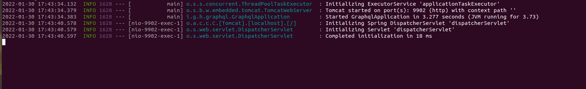
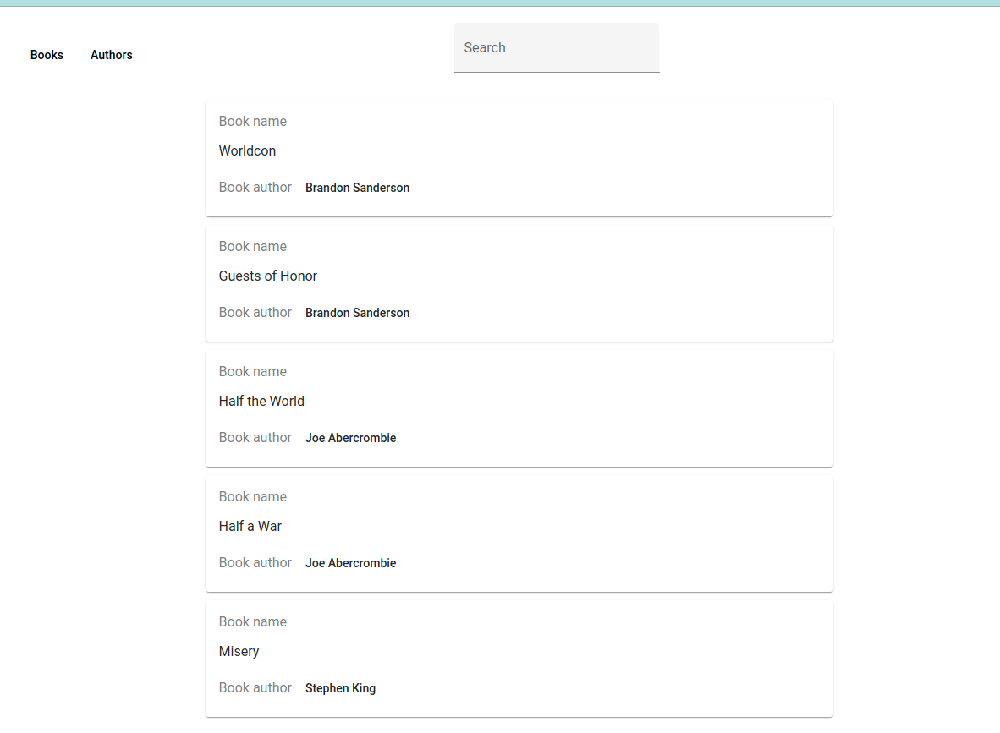

# BookApp

The book app, simple web-app. 

Uses java back.


Java bookApp.jar - uses 9902 port for connection. 
Uses GraphQL api as connection protocol.

To test app, download project, run bookApp.jar
and run Angular-web-application.

Java jar (bookApp.jar) located in JarBack-end folder.
To start java jar just go to jar folder in terminal (Linux)
and start app

```
java -jar bookApp.jar
```
Work server show some this information



To terminate jusct press  Ctrl+C or kill process on port.


In Angular Web-App uses Apollo and connected to 9902 port.

To start Web-Api download all requirements libs.

```
 nmp install 
```

and run project by 
```
 ng serve 
```


Result work you can see in localhost:4200



This project was generated with [Angular CLI](https://github.com/angular/angular-cli) version 9.1.15.


